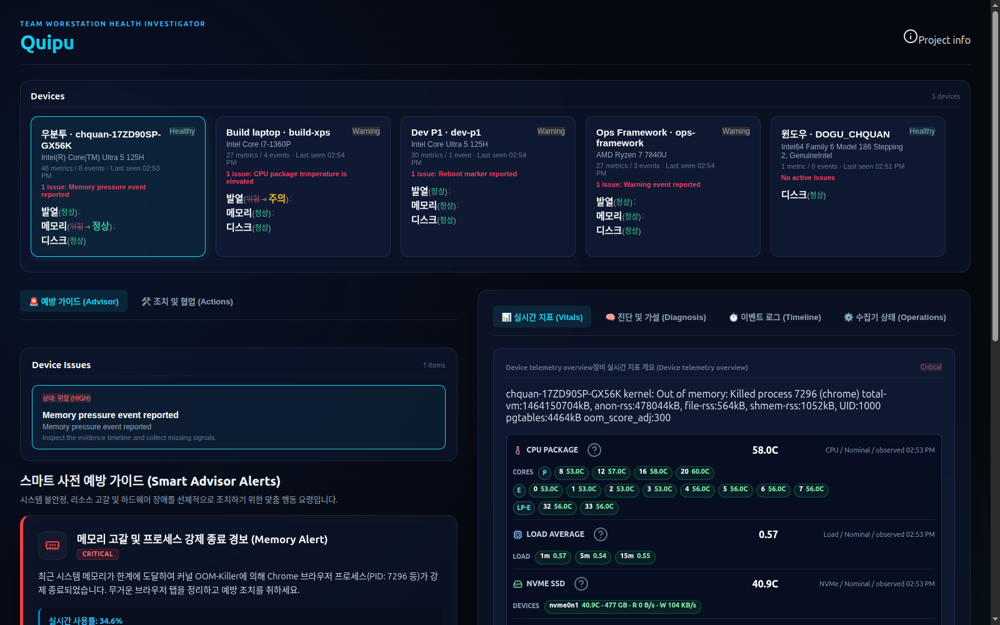

# Quipu

<p align="center">
  
  
  
  
</p>

<p align="center">
  <strong>工作站健康调查工具</strong><br>
  Quipu 不是指标大盘，而是一个本地优先的运维工具：发现多台笔记本/电脑的问题，用证据调查，并记录处置结果。
</p>

<p align="center">
  <a href="README.md">한국어</a> | <a href="README.en.md">English</a> | 简体中文
</p>

---

<p align="center">
  
</p>

## 这是什么

Quipu 把笔记本和开发工作站上的发热、图形错误、Wi-Fi 不稳定、存储警告、
电源问题和重启痕迹收集到同一个界面。仓库内置的 collector 是只读的：
Linux 上读取 sysfs/procfs，Windows 上 best-effort 读取
PowerShell/CIM/netsh/LibreHardwareMonitor 暴露的信号。其他操作系统的
collector 只要遵循同一个 ingest API 合约，也会显示在同一个 UI 中。

第一个问题不是"CPU 多少度？"，而是"现在应该调查什么，证据是什么？"。
核心流程：

```text
Detect -> Triage -> Investigate -> Hypothesize -> Act -> Verify -> Report
```

三个组件：

- `apps/server`：FastAPI ingest/查询 API + SQLite（WAL）存储 + 规则分析。
- `apps/collector`：只读信号收集 CLI（`quipu-collector`），支持 Linux/Windows。
- `apps/web`：Vite + React 调查 UI。

最近的变更见 [CHANGELOG](CHANGELOG.md)。

## 界面结构

顶部是 **Devices** 设备列表：每台上报的机器显示别名/hostname、硬件标签、
metric/event 数量、last seen 和状态转移（如 `之前 ➔ 现在`）。健康设备也可以
选中并查看完整遥测详情。

左侧工作区有两个标签页：

- **🚨 预防指南 (Smart Advisor)**：当前选中设备的活跃调查问题，以及由实时
  遥测生成的 Smart Advisor 提醒卡片（内存、发热、图形等）和检查清单。
- **🛠️ 处置与协作 (Actions)**：intervention 指南、处置记录表单、已记录的
  intervention 列表和团队交接备注。

右侧探索区有四个标签页：

- **实时指标 (Vitals)**：**Metric Ledger**（CPU、Load、NVMe、Wi-Fi 详情行）
  和 **Telemetry Matrix**（CPU profile、memory、disk、NVMe
  health/capacity/I/O、fan、thermal、battery、Wi-Fi link、network、kernel、
  agent freshness 等类别的覆盖状态）。
- **诊断与假设 (Diagnosis)**：规则生成的原因候选、处置前后验证、交接报告。
- **事件日志 (Timeline)**：观测事件的证据时间线。
- **收集器状态 (Operations)**：stale 设备运维卡片和 **Pattern Explorer**
  （按 category/component/model/kernel 聚合的重复信号）。

记录一次处置后，server 会比较处置前后的遥测窗口，返回
`helped / worse / unclear / insufficient_data` 判定。

## 快速开始

启动 API server。脚本会创建虚拟环境并安装依赖，绑定 `0.0.0.0:8000`，
其他设备上的 collector 也能访问。数据库是 `data/quipu.sqlite3`。

```bash
scripts/dev-server.sh
```

另开终端运行 Web UI：

```bash
cd apps/web
npm install
npm run dev
```

打开：

```text
http://127.0.0.1:5173
```

server 启动时不会自动生成数据。首次运行时设备列表为空是正常的。用以下两种
方式之一注入数据。

### 方式 1：注入样例 fleet

想先浏览 UI，可以手动注入确定性样例 fixture（3 台设备：`thinkpad-p1`、
`xps-13`、`framework-13`）：

```bash
cd apps/server
. .venv/bin/activate
python -m quipu_server.seed ../../fixtures/ingest/team-sample.json \
  --database ../../data/quipu.sqlite3
```

要删除样例设备，先停止 server，再删除数据库文件：

```bash
rm -f data/quipu.sqlite3 data/quipu.sqlite3-wal data/quipu.sqlite3-shm
```

### 方式 2：连接当前笔记本

另开终端运行一次 collector：

```bash
sudo apt-get install smartmontools   # 可选，用于 NVMe SMART
cd apps/collector
python3 -m venv .venv
. .venv/bin/activate
pip install -e .
quipu-collector \
  --server-url http://127.0.0.1:8000 \
  --token dev-token \
  --device-id local-computer \
  --device-alias "我的笔记本"
```

刷新 Web UI。

## 连接另一台笔记本或电脑

`scripts/dev-server.sh` 已经绑定 `0.0.0.0`，同一 LAN 的其他机器可以访问
`http://<server-ip>:8000`。如有防火墙，请放行 TCP `8000`。

在每台 Linux 笔记本上安装 collector 并发送到同一个 server：

```bash
cd apps/collector
python3 -m venv .venv
. .venv/bin/activate
pip install -e .
quipu-collector \
  --server-url http://<server-ip>:8000 \
  --token dev-token \
  --device-id office-gram \
  --device-alias "Office Gram"
```

- 每台机器的 `--device-id` 保持唯一且不要更改。
- `--device-alias` 是 UI 显示的别名；有别名时显示为 `alias · hostname`。
- 快速测试可以用 `dev-token`；重复运行建议使用每设备 enrollment token
  （见下文[令牌与认证](#令牌与认证)）。

### 连接 Windows 工作站

Windows 使用同一个 collector package，通过 PowerShell scheduled-task
wrapper 运行。安装或更新版本后，重新安装虚拟环境并重新注册 task：

```powershell
cd C:\path\to\Quipu\apps\collector
py -3 -m venv .venv
.\.venv\Scripts\pip.exe install -e .
cd C:\path\to\Quipu
powershell.exe -ExecutionPolicy Bypass -File scripts\install-collector-scheduled-task.ps1 `
  -InstallSensorTools `
  -Highest `
  -ServerUrl http://<server-ip>:8000 `
  -Token dev-token `
  -DeviceId windows `
  -DeviceAlias "Windows"
```

- `-InstallSensorTools`：安装官方 sensor 工具（LibreHardwareMonitor 等）。
- `-Highest`：启用需要管理员权限的 sensor（CPU core 温度、风扇 RPM）。

scheduled task 在用户登录时隐藏运行，防止重复 collector 循环，保持
offline buffer，默认每 5 分钟发送一次。Windows metric 缺失的诊断步骤见
[用户手册](USER_MANUAL.md)。

## Collector 采集的信号

collector 只读采集系统信号，没有远程命令执行，也没有自动修复。它只在
state 目录保存上一次 sector counter，用于计算 NVMe 读写速率。

| 类别            | 代表 metric                                                                                                                                                                                                                                           | 来源（Linux / Windows）                                          |
| --------------- | ----------------------------------------------------------------------------------------------------------------------------------------------------------------------------------------------------------------------------------------------------- | ---------------------------------------------------------------- |
| CPU load        | `cpu.load_1m/5m/15m`（Linux）；`cpu.load_percent`、`cpu.core_<n>.load_percent`（Windows）                                                                                                                                                             | `/proc/loadavg` / hardware monitor `Load` sensor                 |
| CPU 拓扑        | `cpu.physical_cores`、`cpu.logical_threads`、`cpu.performance_cores`、`cpu.efficient_cores`、`cpu.low_power_efficient_cores`                                                                                                                          | `/proc/cpuinfo` / CIM                                            |
| CPU 温度        | `cpu.package_temp_c`、`cpu.core_<n>.temp_c`、`cpu.p_core_<n>.temp_c`、`cpu.e_core_<n>.temp_c`                                                                                                                                                         | hwmon coretemp / LibreHardwareMonitor·OpenHardwareMonitor        |
| Thermal zone    | `thermal.<sensor>.temp_c`、`thermal.windows_zone_<n>.temp_c`                                                                                                                                                                                          | sysfs thermal / ACPI·performance counter                         |
| NVMe 温度·SMART | `nvme.temp_c`、`nvme.smart_passed`、`nvme.critical_warning`、`nvme.available_spare_percent`、`nvme.percentage_used_percent`、`nvme.media_errors`、`nvme.power_on_hours`、`nvme.unsafe_shutdowns`、`nvme.error_log_entries` + 每设备 `nvme.<device>.*` | hwmon·sysfs·`smartctl --json` / reliability counter·smartctl     |
| NVMe 容量·I/O   | `nvme.capacity_bytes`、`nvme.read_bytes_per_sec`、`nvme.write_bytes_per_sec` + 每设备                                                                                                                                                                 | sysfs block（两次样本差值） / performance counter                |
| Wi-Fi           | `wifi.signal_dbm`、`wifi.rx_bitrate_mbps`、`wifi.tx_bitrate_mbps`、`wifi.link_bitrate_mbps` + 每接口                                                                                                                                                  | `/proc/net/wireless`·`iw`·`iwconfig` / `netsh`·WMI               |
| 内存·磁盘·电源  | `memory.used_percent`、`disk.root_used_percent`、`battery.capacity_percent`、`battery.ac_online`                                                                                                                                                      | procfs·sysfs / CIM                                               |
| 风扇            | `fan.rpm`、`fan.<sensor>.rpm`                                                                                                                                                                                                                         | hwmon（所有可读风扇） / hardware monitor sensor                  |
| 事件            | thermal、storage、power、graphics、memory、network、reboot、update                                                                                                                                                                                    | kern.log·journalctl 等 / Windows Event Log（System·Application） |

Core 编号遵循 OS 暴露的 sensor/core id，不会虚构缺失编号。Wi-Fi bitrate 是
与 AP 的链路速率，不是互联网测速。NVMe 读写速率需要两次样本，首次样本可能
为空。

Windows 上如果能看到 `cpu.core_<n>.load_percent` 但没有 `cpu.*.temp_c`，
这不是 UI 问题，而是 hardware monitor 的 `Temperature` sensor 没有暴露给
collector。诊断步骤见[用户手册](USER_MANUAL.md)。

## Collector 常用选项

```bash
quipu-collector --dry-run                          # 只输出 JSON，不发送
quipu-collector --server-url URL --token TOKEN     # 采集并发送一次
quipu-collector --dry-run --interval 60 --iterations 3   # 60 秒间隔 3 次
```

| 选项                                | 默认值                                 | 说明                                           |
| ----------------------------------- | -------------------------------------- | ---------------------------------------------- |
| `--server-url`                      | （无）                                 | 省略时只向 stdout 输出 JSON                    |
| `--token`                           | （无）                                 | 使用 `--server-url` 时必需（`--dry-run` 除外） |
| `--device-id` / `--device-alias`    | 自动生成 / （无）                      | 设备唯一 ID / UI 别名                          |
| `--interval` / `--iterations`       | （无）                                 | 重复采集间隔（秒）/ 次数                       |
| `--offline-buffer`                  | 关                                     | 发送失败时本地 spool，下次成功时 flush         |
| `--spool-dir`                       | `~/.local/state/quipu/collector-spool` | spool 位置                                     |
| `--spool-max-batches`               | `288`                                  | spool 保留数量（5 分钟间隔约一天）             |
| `--state-dir`                       | `~/.local/state/quipu/collector-state` | NVMe 速率差值计算状态                          |
| `--flush-limit` / `--retry-backoff` | （无） / `0`                           | flush 上限 / 失败后等待（秒）                  |

## Server API 摘要

所有路径都在 `/api` 下。认证 header 是 `X-Quipu-Agent-Token`。

| 路径                                                                              | 用途                                 | 认证         |
| --------------------------------------------------------------------------------- | ------------------------------------ | ------------ |
| `GET /api/health`                                                                 | 存活检查                             | 无           |
| `POST /api/ingest/batches`                                                        | 接收观测 batch（新建 201，重复 200） | ingest token |
| `GET /api/fleet/overview`                                                         | fleet 设备摘要                       | 无           |
| `GET /api/investigations/queue`                                                   | 优先级调查队列                       | 无           |
| `GET /api/investigations/{id}`                                                    | 调查详情（含 intervention）          | 无           |
| `GET·POST /api/investigations/{id}/notes`                                         | 读取/写入交接备注                    | 无           |
| `POST /api/investigations/{id}/interventions`                                     | 记录处置                             | 无           |
| `GET /api/patterns/overview`                                                      | 重复信号模式                         | 无           |
| `POST·GET /api/enrollment/tokens`、`POST .../{id}/rotate`、`POST .../{id}/revoke` | 每设备 token 签发/查询/轮换/吊销     | dev token    |
| `GET /api/admin/schema`                                                           | 查看 schema 版本和表                 | dev token    |

## 令牌与认证

- 开发默认 token 是 `dev-token`，可用 `QUIPU_DEV_AGENT_TOKEN` 环境变量修改。
- ingest 接受 dev token，或为该 `device_id` 签发的活跃 enrollment token。
  每设备 token 只以 SHA-256 hash 存储。

```bash
curl -sS -X POST http://127.0.0.1:8000/api/enrollment/tokens \
  -H "Content-Type: application/json" \
  -H "X-Quipu-Agent-Token: dev-token" \
  -d '{"device_id":"office-gram","label":"Office Gram collector"}'
```

把返回的 `token` 填入该机器 collector 的 `--token`。

## 环境变量

| 变量                                                                                                                                                                                                                 | 组件                   | 默认值                  | 说明                                       |
| -------------------------------------------------------------------------------------------------------------------------------------------------------------------------------------------------------------------- | ---------------------- | ----------------------- | ------------------------------------------ |
| `QUIPU_DATABASE_PATH`                                                                                                                                                                                                | server                 | `data/quipu.sqlite3`    | SQLite 路径                                |
| `QUIPU_DEV_AGENT_TOKEN`                                                                                                                                                                                              | server                 | `dev-token`             | 开发/管理 token                            |
| `QUIPU_SERVER_URL`、`QUIPU_AGENT_TOKEN`、`QUIPU_COLLECTOR_DEVICE_ID`、`QUIPU_COLLECTOR_DEVICE_ALIAS`、`QUIPU_SPOOL_DIR`、`QUIPU_SPOOL_MAX_BATCHES`、`QUIPU_STATE_DIR`、`QUIPU_COLLECTOR_BIN`、`QUIPU_COLLECTOR_ROOT` | collector 运维 wrapper | —                       | 由 systemd/Windows wrapper 转换为 CLI 参数 |
| `QUIPU_COLLECTOR_INTERVAL`、`QUIPU_COLLECTOR_ENV`                                                                                                                                                                    | Windows wrapper        | `300` / —               | 采集间隔（秒）/ 配置文件路径               |
| `QUIPU_SMARTCTL_BIN`                                                                                                                                                                                                 | collector              | 自动探测                | 指定 smartctl 路径                         |
| `QUIPU_LIBRE_HARDWARE_MONITOR_DLL`                                                                                                                                                                                   | collector（Windows）   | 自动探测                | 指定 LibreHardwareMonitorLib.dll 路径      |
| `VITE_API_BASE_URL`                                                                                                                                                                                                  | web                    | `http://127.0.0.1:8000` | Web UI 调用的 API 地址                     |

## 运维安装

Linux 上由 systemd timer 每 5 分钟运行一次 collector：

```bash
scripts/install-collector-systemd.sh --dry-run   # 预览
sudo scripts/install-collector-systemd.sh --no-enable
sudo systemctl enable --now quipu-collector.timer
```

配置放在 `/etc/quipu/collector.env`。完整运维流程（Windows scheduled task
安装、环境文件、卸载）见[用户手册](USER_MANUAL.md)。

## 架构

```text
Linux collector / Windows collector / compatible external collector
      |
      v
FastAPI ingest API  (X-Quipu-Agent-Token)
      |
      v
SQLite WAL store
      |
      v
Rule-based analysis engine
      |
      v
React investigation UI
```

## 验证

CI 在 Python 3.12 和 Node 24 上运行相同检查。

```bash
cd apps/server && . .venv/bin/activate && pytest -v
cd apps/collector && . .venv/bin/activate && pytest -v
cd apps/web && npm test && npm run build
```

## 仓库结构

```text
apps/
  collector/     只读 collector CLI（Linux/Windows）+ systemd/scheduled-task 运维脚本
  server/        FastAPI API、SQLite 存储、规则分析、手动 seed CLI
  web/           Vite React 调查 UI
data/            本地 SQLite DB（dev-server.sh 使用）
docs/
  superpowers/   产品决策、dashboard、roadmap、ship checklist
fixtures/
  ingest/        确定性样例 batch（team-sample.json）
scripts/
  dev-server.sh                          本地 API server（0.0.0.0:8000）
  install-collector-systemd.sh           Linux collector 安装/卸载
  install-collector-scheduled-task.ps1   Windows collector 安装/卸载
```

## 文档

- [用户手册](USER_MANUAL.md) — 安装、运维、界面解读、故障排查
- [Changelog](CHANGELOG.md)
- [Contributing](CONTRIBUTING.md)
- [Security Policy](SECURITY.md)
- [Project dashboard](docs/superpowers/DASHBOARD.md)
- [Roadmap](docs/superpowers/ROADMAP.md)
- [Ship checklist](docs/superpowers/SHIP_CHECKLIST.md)

## 边界

本版本不包含：

- 远程修复命令执行
- 生产部署
- package publishing
- 仅靠 AI 的结论
- raw log warehouse

Quipu 的默认原则是本地优先、只读、基于证据。
