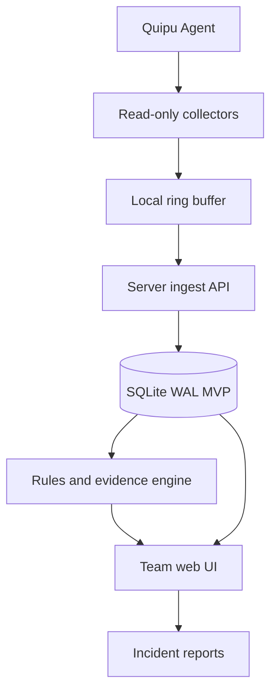

# Quipu Team Health Investigator Design

> Status: draft for review
> Date: 2026-07-07
> Owner: chquan

## Summary

Quipu is a self-hosted workstation health investigator for small technical
teams. It collects lightweight health signals from multiple Linux laptops or
developer workstations and turns them into incident timelines, recurring issue
patterns, evidence cards, and recommended next checks.

The product should not compete by showing more charts than Netdata, Grafana, or
Prometheus. Its first wedge is explanation: which machines are unstable, what
changed before the incident, what evidence supports each hypothesis, and whether
an intervention improved the situation.

## Assumptions

- Initial fleet size is 3-20 Linux machines.
- The first deployment is self-hosted on one trusted team server.
- Agents are read-only by default.
- The product is useful without cloud services.
- Rule-based analysis must work before AI assistance is added.
- Raw logs can contain sensitive data, so storage must be selective and
  redaction-aware.

## Non-Goals For MVP

- Cloud-hosted SaaS.
- Large enterprise fleet management.
- Remote command execution.
- Automatic system repair.
- Full replacement for Grafana, Prometheus, Netdata, Glances, or Cockpit.
- Long-term high-cardinality metrics warehouse.

## Product Position

Quipu sits between system monitors and observability platforms:

- System monitors show current state.
- Observability platforms aggregate metrics, logs, and alerts.
- Quipu explains workstation incidents for a team, with local evidence and
  operator-friendly next actions.

Competitive references:

- Netdata emphasizes real-time infrastructure monitoring.
- Glances focuses on compact cross-platform system monitoring.
- Cockpit provides browser-based Linux administration.
- Grafana and Prometheus cover broader observability and time-series workflows.

Quipu should avoid becoming a generic dashboard. The differentiator is
team-level incident reasoning for developer workstations.

## Core User Stories

1. As a team lead, I want to see which machines are currently at risk so I can
   intervene before the user loses work.
2. As a developer, I want to know whether my machine's freeze was likely thermal,
   graphics/session, storage, network, memory, update, or power related.
3. As an operator, I want to compare similar incidents across machines so I can
   identify model-specific, kernel-specific, or environment-specific patterns.
4. As a troubleshooter, I want raw evidence links for each hypothesis so I can
   verify the reasoning instead of trusting a black box.
5. As a user testing a fix, I want before/after comparisons for cooling changes,
   kernel updates, power settings, driver changes, or workload changes.

## Main Surfaces

### Team Overview

Shows fleet health at a glance:

- Machines online/offline.
- Current thermal, load, disk, Wi-Fi, battery, and throttling risk.
- Recent incidents by severity.
- Repeated patterns across machines.
- Machines needing attention.

### Device Detail

Shows one machine's current state and history:

- Sensor summary.
- Load and pressure indicators.
- Storage and network state.
- Recent journal events.
- Known missing permissions or unreliable sensors.
- Intervention history.

### Incident Timeline

Reconstructs an event window around a freeze, hard power-off, thermal warning,
graphics/session error, storage warning, or user-marked incident:

- Pre-incident sensor trend.
- Load/process context.
- Kernel and system journal evidence.
- Package/update events.
- Session/graphics warnings.
- Storage/network anomalies.
- Reboot and unclean shutdown markers.

### Pattern Explorer

Groups incidents across machines:

- Same laptop model.
- Same kernel version.
- Same GPU driver family.
- Same SSD model.
- Similar thermal profile.
- Similar log signatures.

### Intervention Tracker

Records changes and compares before/after:

- Lifted laptop, cooling stand, fan cleaning.
- Power profile change.
- Kernel or driver update.
- BIOS/firmware update.
- Workload change.

## Architecture

## Components

### Quipu Agent

Runs on each machine and batches lightweight observations to the team server.

Responsibilities:

- Collect sensor readings and normalized system signals.
- Keep a short local ring buffer for offline periods.
- Send signed batches to the server.
- Report collector health, missing permissions, and sensor reliability.

Initial collectors:

- CPU package and core temperatures.
- Load average, CPU usage, memory pressure.
- Disk temperature and SMART health when permission allows.
- NVMe warnings from system logs.
- Wi-Fi signal, reconnects, and driver warnings.
- Battery and power profile state.
- Thermal throttling warnings and counters.
- Kernel, graphics/session, storage, network, update, and reboot markers from
  `journalctl`.

### Quipu Server

Receives data from agents, stores it locally, and powers the UI.

Responsibilities:

- Device registration and token management.
- Batch ingestion with idempotency.
- Clock drift detection.
- Event normalization.
- Retention and redaction policy.
- Query API for UI and reports.

Storage default:

- SQLite WAL for MVP.
- Keep schema portable enough to add Postgres later.

### Analysis Engine

Starts rule-based. AI can be added later only as a summarizer or hypothesis
generator with evidence links.

Initial hypothesis categories:

- Thermal or power limit.
- Graphics/session instability.
- Storage warning or I/O stall.
- Network/Wi-Fi instability.
- Memory pressure or process runaway.
- Update or package-change correlation.
- Unknown with insufficient evidence.

Each finding must include:

- Confidence level.
- Supporting evidence.
- Contradicting evidence.
- Suggested next checks.
- Raw command/log references where available.

### Team Web UI

The first UI should be dense and operational, not a marketing page.

Primary navigation:

- Fleet
- Incidents
- Patterns
- Devices
- Interventions
- Settings

Design principles:

- Prioritize scanning, comparison, and drilldown.
- Show evidence before conclusions.
- Clearly label missing or unreliable data.
- Never hide raw source references from expert users.
- Avoid nested cards and decorative dashboard noise.

## Data Model

Core entities:

- Team
- User
- Device
- Agent
- ObservationBatch
- MetricSample
- Event
- Incident
- Finding
- Intervention
- EvidenceLink

Important event fields:

- `device_id`
- `observed_at`
- `received_at`
- `source`
- `category`
- `severity`
- `message_summary`
- `raw_ref`
- `fingerprint`

## Data Flow

1. Agent samples sensors and logs.
2. Agent normalizes values into batches.
3. Agent signs and sends batches to server.
4. Server validates, deduplicates, and stores.
5. Analysis engine creates or updates incidents and findings.
6. UI shows fleet status, drilldowns, and evidence.
7. User records interventions or marks incident windows.
8. Analysis compares before/after windows.

## Security And Privacy

MVP requirements:

- No remote command execution.
- No destructive agent actions.
- Agent tokens scoped per device.
- Local self-hosted server by default.
- Redact secrets and obvious tokens from journal excerpts.
- Store minimal excerpts by default, not full raw logs.
- Make retention configurable.

Risk areas:

- Journal logs can include usernames, file paths, URLs, command names, and
  application data.
- Device names can reveal identities or internal structure.
- AI summaries can overstate uncertain causes.

Mitigation:

- Evidence-linked findings only.
- Confidence labels.
- Local-first storage.
- Redaction filters before persistence.
- Admin-visible data inventory.

## Failure Modes

| Failure | Expected behavior |
| --- | --- |
| Agent offline | Mark device stale, keep last known state, ingest buffered data later |
| Server unavailable | Agent writes to local ring buffer and retries |
| Clock drift | Store both observed and received times, flag drift |
| Missing sensor | Show unavailable state, do not infer false normality |
| Permission denied | Report collector degraded with suggested permission |
| Duplicate batch | Deduplicate by device, batch id, and sample timestamp |
| Log flood | Rate-limit raw event storage and keep fingerprints |
| AI uncertainty | Fall back to rule-based evidence and label unknown |

## MVP Acceptance Criteria

- Register at least three Linux devices.
- Show online/offline and stale status.
- Show current CPU package/core temperatures when available.
- Show load average and basic memory/disk/network state.
- Detect and display recent thermal, graphics/session, storage, network, update,
  reboot, and unclean-shutdown events.
- Create an incident timeline from a user-selected time window.
- Show evidence-linked findings with confidence labels.
- Record an intervention and compare before/after windows.
- Work without cloud dependencies.
- Keep agent overhead low enough to be unnoticeable during normal work.

## Out-of-Scope Until After MVP

- Mobile app.
- Hosted cloud service.
- Cross-organization tenancy.
- Remote shell or repair actions.
- Predictive failure ML.
- Large-scale Prometheus-compatible metrics ingestion.
- Billing.

## First Implementation Plan Topics

The implementation plan should decide:

- Agent language and packaging.
- Server/API/UI stack.
- SQLite schema and retention policy.
- Collector permission strategy.
- Redaction rules.
- Incident fingerprinting rules.
- UI layout and responsive behavior.
- Test fixtures for sensors and journal excerpts.

## Open Questions

- Should the first agent be Rust or Go?
- Should the first UI/server be a single full-stack app or split services?
- Which Linux distribution should be the primary development target?
- Should device registration be manual tokens first or browser-based enrollment?
- How much raw journal context is acceptable to store by default?
