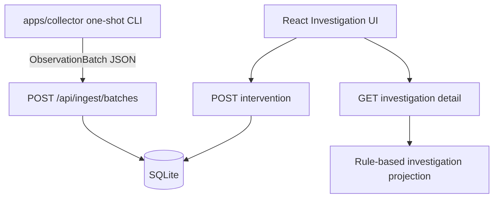

# Quipu v0.2.0 Foundation Design

> Status: approved for autonomous implementation
> Date: 2026-07-07
> Owner: chquan

## Meaning Check

Quipu's next useful step is to stop being only a seeded dashboard and start
closing the loop from real local signals to a recorded human intervention.

The smallest valuable wedge is:

> A developer can run a read-only collector once, ingest the batch, see an
> investigation, record what they tried, and have CI enforce that this path does
> not regress.

## Alternatives

| Option | Description | Strength | Failure Condition |
| --- | --- | --- | --- |
| CI only | Add GitHub Actions and stop there. | Improves release discipline quickly. | Product still depends on fixture data. |
| Collector only | Build a local signal collector. | Moves toward real machine data. | Still cannot record whether a human action helped. |
| Thin vertical loop | Add CI, one-shot collector, and intervention records. | Connects detect -> act -> verify foundations. | Scope expands into daemon, auth, or deep log scraping. |

Selected: thin vertical loop.

## Scope

Included:

- GitHub Actions CI for server tests, web tests, and web build.
- A Python read-only collector package under `apps/collector`.
- One-shot collector CLI that prints an `ObservationBatch` JSON payload.
- Optional collector POST to the existing ingest API when server URL and token
  are supplied.
- Server-side intervention records tied to investigation item IDs.
- Investigation detail includes recorded interventions and adjusts the
  verification summary when interventions exist.
- React UI shows recorded interventions and can record a short intervention.

Excluded:

- Background daemon or systemd unit.
- Root-only collection.
- Raw log upload.
- Remote commands or repair actions.
- Public release or package publishing.

## Architecture

## Collector Contract

The collector is read-only and stdlib-only. It reads local Linux files when they
exist and silently skips unavailable signals.

Signals:

- Device identity: hostname, optional machine-id-derived device ID, model, OS,
  kernel.
- Load: `/proc/loadavg` -> `cpu.load_1m`.
- Memory: `/proc/meminfo` -> `memory.used_percent`.
- Thermal zones: `/sys/class/thermal/*/temp` -> thermal temperature metrics.
- NVMe hwmon temperature when exposed under `/sys/class/hwmon`.
- Wi-Fi link level when exposed by `/proc/net/wireless`.

The collector must emit at least one metric on a normal Linux machine. If no
signals exist in a test fixture, it should fail clearly rather than sending an
empty batch.

## Intervention Contract

An intervention record is a local human action, not an automated fix.

Fields:

- `investigation_id`
- `device_id`
- `category`
- `label`
- `description`
- `expected_effect`
- `recorded_at`
- `verification_status`

Verification stays conservative:

- No intervention: `Needs before/after data`.
- Intervention recorded: `Waiting for after window`.

## UI Design

The existing investigation-first surface stays intact. The `Action plan` panel
gets a compact form to record a human action. The `Verification` panel keeps the
same role but reflects whether an intervention is now waiting for after-window
evidence. A new `Recorded interventions` panel makes the action history visible
without turning the screen into a form-heavy workflow.

## Test Strategy

- Server repository tests cover persisting and listing intervention records.
- Server API tests cover POST intervention and detail projection.
- Collector tests use temporary `/proc` and `/sys` fixtures.
- Web tests mock queue/detail/post flows and assert intervention UI rendering.
- CI runs the same server and web checks used locally.

## Risks

- Hardware sensors vary widely. The collector must skip missing files and keep
  metrics best-effort.
- `/etc/machine-id` can be sensitive if copied raw. The collector uses a short
  hash-derived ID and does not include the raw value.
- Intervention records can imply causality too early. The wording must say
  "waiting for after window" until comparison data exists.
